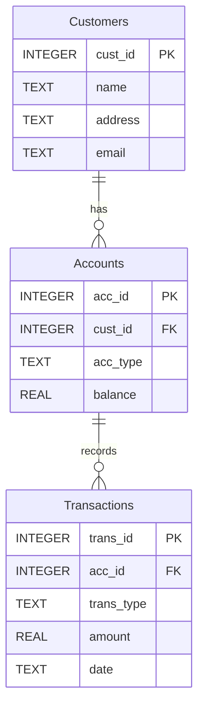

# Bank Account Database (Python + SQLite)

This project builds a simple **bank** database in SQLite using Python,
seeds sample data, and publishes both the DB file and a readable Markdown view.

- **Database file**: [Bank.db](./Bank.db)
- The full logical view (ER diagram + tables) is embedded below.

## Quick start (local)
```bash
python createDB.py      # create tables
python InsertData.py    # insert sample data
python Queries.py       # print reports to the console
```

> Requires Python 3.x. No third-party packages are needed (uses the stdlib `sqlite3`).

---
# Bank — Logical View

## ER Diagram


## Tables

### Customers
| cust_id |    name    |   address    |             email              |
|---------|------------|--------------|--------------------------------|
| 110     | Lionel     | Rosario      | leomessi@gmail.com             |
| 111     | Ronaldinho | Porto Alegre | ronaldinhogaucho10@gmail.com   |
| 112     | Zlatan     | Malmo        | iamzlatamibrahimovic@gmail.com |
| 113     | Mario      | Palermo      | whyalwaysme45@gmail.com        |

### Accounts (with owner)
| acc_id |   owner    | acc_type | balance |
|--------|------------|----------|---------|
| 101    | Lionel     | Savings  | 2500.0  |
| 102    | Ronaldinho | Checking | 12000.0 |
| 103    | Zlatan     | Savings  | 1500.0  |
| 104    | Mario      | Checking | 1700.0  |

### Transactions
| trans_id | acc_id | trans_type | amount |    date    |
|----------|--------|------------|--------|------------|
| 1        | 101    | deposit    | 500.0  | 2022-12-18 |
| 2        | 102    | withdrawal | 100.0  | 2006-11-19 |
| 3        | 103    | deposit    | 300.0  | 2012-11-14 |
| 4        | 104    | withdrawal | 610.0  | 2011-10-23 |
| 5        | 102    | deposit    | 500.0  | 2006-11-25 |
| 6        | 103    | withdrawal | 100.0  | 2018-09-17 |
| 7        | 104    | deposit    | 500.0  | 2009-09-29 |
| 8        | 104    | withdrawal | 100.0  | 2012-06-28 |
